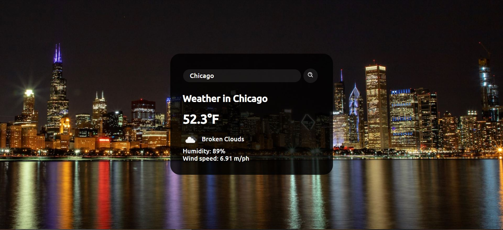

# Weather App
Simple weather app using HTML, CSS, and JavaScript that fetches weather and geolocation information from OpenWeatherMap API. Background image is randomaly generated based on location using Unsplash API.

[Demo](https://cfranco-1.github.io/Weather-App/)

## APIs
- [OpenWeatherMap](https://openweathermap.org/api)
- [Unsplash](https://unsplash.com/developers)
